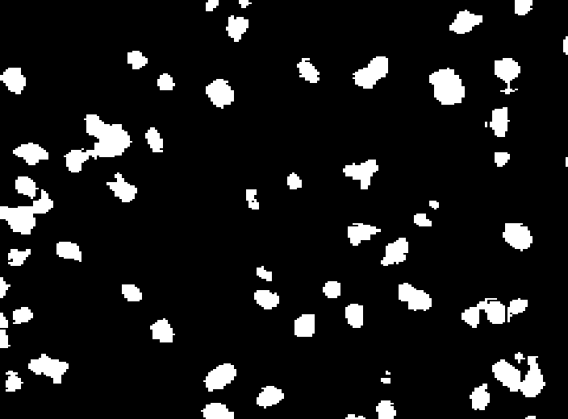

# threeV_assignment
Segmentation model to create a binary mask to segment livecell dataset. 

There are two main directories in this repo:
- model_development contains scripts related to model R&D and training
- model_deployment contains scripts related to the deployment of the trained model
More details about each directory are mentioned below

## Exploring the Dataset
[Livecell](https://github.com/sartorius-research/LIVECell?tab=readme-ov-file) data is originally in COCO format. Each image has some living biological cells of various types.   

Below is the distribution of train, valid and test images:
- Total # of train images: 3188
- Total # of validation images: 569
- Total # of test images: 1512

Though annotations are available for various types of cells for each image separately and one polygon for every individual cell, I will only be working with one binary masks by merging all polygons (cell segmentations) into one ground truth mask

Here are some visualizations of images and binary masks.


## Model R&D and Training

### Directory structure

- model development
    - segmentation_model
        - helpers.py --contains helper functions used in training scripts
        - image_transforms.py --Class definitions for various image transforms used for data augmentation
        - livecell_dataset.py --definition for Dataset class inherited from the original torch.utils.data.Dataset class
        - swin_transformer.py --main backbone architecture of the swinUNet model for segmentation
    - requirements.txt --necessary dependancies to replicate the training
    - threeV_segmentation.ipynb --main python notebook with training related code.

### Segmentation backbone

This project uses swin transformer based UNet model to perform the segmentation.


The Swin Transformer-based U-Net model is an advanced architecture that combines the strengths of Transformers and the U-Net structure, specifically designed for image segmentation tasks. It has various advantages over other transformer based architectures

1. **Hierarchical Feature Representation**  
   The Swin Transformer captures multi-scale features through its hierarchical structure, which enhances the model's ability to understand complex patterns and details at different resolutions.

2. **Global Context**  
   Unlike traditional convolutional layers, Swin Transformers utilize self-attention mechanisms, enabling the model to capture global context and long-range dependencies, which is crucial for precise segmentation.

3. **Efficient Computation**  
   Swin Transformers are designed with a shifted window approach that reduces computational complexity while maintaining strong performance, making them efficient for high-resolution image segmentation.

4. **Flexible and Scalable**  
   The modular nature of Swin Transformers allows for easy scaling and adaptation to various tasks, making them versatile for different segmentation challenges across a range of applications.

### Model Training

This segmentation model is a Pytorch model and has almost ~3M parameters. It takes input images of size 224,224 and generates masks of same size. So, we will have to resize the input images to size 224,224 and then interpolate the generated mask back to the original size of the image (All this is taken care of automatically in deployment). Some important pointers from training:
- BCEWithLogitsLoss function is used from torch.nn
- AdamW optimizer is used from torch.optim
- I tried CosineAnnealingLR and CosineAnnealingWithWarmRestarts lr schedulers from torch.optim
- ClearML is used to monitor and compare training (with different hyperparameters)

Although all experiments converged to similar IOU. Here is the config of the model used in deployment.

```python
{
    'version': 'swin_Unet_v0.0.1', 
    'training': {
        'batch_size': 32, 
        'num_workers': 4, 
        'num_epochs': 100, 
        'learning_rate': 0.001, 
        'min_lr': 1e-06, 
        'min_epochs': 25, 
        'early_stopping': 5, 
        'class_weigths': None}, 
    'data': {
        'image_height': 224, 
        'image_width': 224, 
        'num_classes': 1, 
        'transforms': {
            'flip_prob': 0.5, 
            'affine_prob': 0.25, 
            'blur_prob': 0.25
            }
        }, 
    'testing': {'threshold': 0.5}
}
```
Training and Validation dynamics for the above experiment looks like this:


Mean IOU over all test images for this version: 78.8%

Link to the ClearML experiment for above training version: [ClearML Link](https://app.clear.ml/projects/b6500db0a04e4b52a9995ea694a67841/experiments/ac69e2f5eaf0496fafb748f809b80de5/output/execution)

If you wish to repeat the trainings, please make sure to have all dependancies mentioned in the requirements.txt file installed in your environment and follow each cell in threeV_segmentation.ipynb notebook. This is developed on a Colab environment. So, there might be some code specific to Colab environment. Please double check the code if you wish to replicate the experiments.

Here are some visualizations of the masks generated by the model for different types of living cells


## Deployment

This is the repository for app backend. This application is powered by Flask and written in python.

### Directory structure

- model_deployment
    - segmentation_model --main brains of the application
        - model_sc 
            - swin_transformer.py --source code of the backbone architecture; isolated from dev environemnt for sanity
        inf_helpers.py --all other helper class definition to load the model and perform the inference
    - test_images --some images used for testing and masks generated by the model
    - .dockerignore --files to ignore by the docker while creating the docker image
    - app.py --main engine of the application powered by Flask
    - Dockerfile --docker script to create the application image
    - requirements.txt --necessary dependancies

Steps to perform the inference:

1. Clone the repository
2. cd to model_deployment directory
    - `cd ./model_deployment`
3. run the docker command to create docker image. Sorry, I do not have this image on docker hub
    - `docker build -t live_cell_sgmtn`
4. run the docker command to create a container app using the docker image and to start the endpoint
    - `docker run -p 5050:5050 -v /path/to/threeV_assignment/model_deployment/test_images:/test_image live_cell_sgmtn`
    - Make sure to edit above command to mention proper abs path for volume mounting as this will be used to access images and store the masks
5. Use below request (check the command for abs paths) to run the inference. This command will run model inferecen and save the mask in test_images folder mounted above
    - `curl -X POST -H "Content-Type: application/json" -d '{"image_path": "/Users/manikantamandlem/Desktop/threeV_assignment/model_deployment/test_images/A172_Phase_C7_1_00d00h00m_1.tif"}' http://localhost:5050/seg_mask`
    - Optionally you can also use POSTMAN to hit the `seg_mask ` endpoint if you want to

Below is a test image and the mask generated by the seg_mask application

Original Image


Mask

